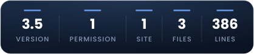
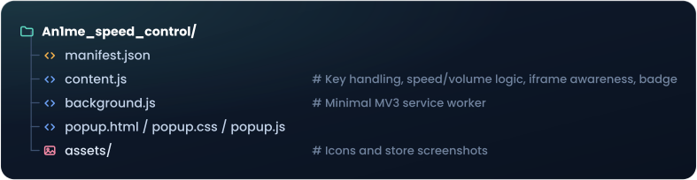

 

##  What it does

The an1me.to player has no speed control, and the video lives inside an iframe, so the usual
extensions do not reach it. This one does.

Two keys, no on-screen clutter:

| Key | Behaviour |
|---|---|
|  | **Hold** to boost. Let go and you are instantly back to normal speed. |
|  | **Toggle** the boost on and off. |

Everything else it does happens quietly: it remembers the speed, volume and mute state you prefer,
and restores them on the next episode.

##  Features

- **Hold-to-boost ()** — perfect for a recap or an intro, no toggling back afterwards.
- **Toggle boost ()** — for when you want to stay fast for a while.
- **Choose your boost speed** in the popup: **1.5× · 2× · 3× · 4× · 8×**.
- **Remembers your normal speed** — set the player to 1.25×, and 1.25× is what  releases back to.
- **Remembers volume and mute**, applied automatically when the next video loads.
- **Works inside the iframe player**, which is the entire reason this exists.
- **On-screen badge** confirming what just changed, then it gets out of the way.

##  Install

1. Download the repository (`Code` → `Download ZIP`) and unzip it.
2. Open  (or ).
3. Enable **Developer mode**.
4. Click **Load unpacked** and select this **`An1me_speed_control` folder**.
5. Open an episode on an1me.to and hold .

##  How to use

1. Click the toolbar icon and pick your **boost speed** (defaults to 4×).
2. Play an episode.
3. **Hold ** through anything you want to skim — release to return to normal.
4. **Press ** if you would rather leave it running; press it again to stop.

Speeds up to 2× are treated as a "normal" speed and saved as your default. Higher values are treated
as a boost and are never saved as your baseline — so an 8× skim does not become your new normal.

##  Permissions explained

| Permission | Why it is needed |
|---|---|
| `storage` | Your boost speed, default speed, volume and mute state. Local only. |
| `https://an1me.to/*` | The only site it runs on — including the player iframe (`all_frames`). |

No tabs, no history, no network access.

##  Privacy, briefly

**Everything stays on your machine.** Four values in local extension storage. No network requests,
no analytics, no account, nothing collected.

##  How the code is organised

##  Troubleshooting

<b>F7 or F8 does nothing</b>

 

Click **on the video once** so the page has keyboard focus, then try again. If the focus is in the
browser chrome (address bar, search box), the page never sees the key.

<b>F7 is taken by something else</b>

 

Some laptops map  to a media or brightness key at the firmware level. Try  + , or use
 instead — it does the same job as a toggle.

<b>My volume keeps resetting</b>

 

Volume is saved shortly after you change it, so a change made in the last fraction of a second
before closing the tab may not persist. Adjust it and give it a moment.

<b>It stopped working after an an1me.to redesign</b>

 

The player container may have moved.

##  Licence

Source-available, all rights reserved.

**Not affiliated with, endorsed by, or connected to an1me.to.**
