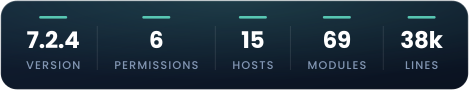
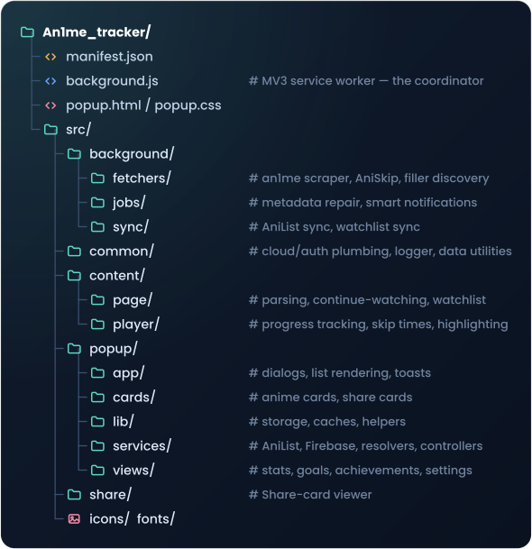

 

##  What it does

You watch anime on **an1me.to**. The tracker sits quietly in the background and remembers
everything for you: which episode you are on, how far into it you got, what you have finished, and
what just aired. Open the popup and your whole library is there — sorted, searchable, with covers,
stats and a bit of gamification to keep you honest.

If you sign in, it all syncs to the cloud so your phone-side browser and your desktop agree with
each other. If you don't sign in, it still works — everything just stays local.

##  Features

### Tracking that happens by itself

- **Automatic progress detection** — starts a video, the episode gets recorded. No buttons.
- **Resume where you left off** — reopens an episode at the second you stopped.
- **Continue Watching row** injected on the an1me.to homepage.
- **Episode highlighting** — watched episodes are visually marked on the series page.
- **Skip outro** button, with timings pulled from .
- **Movies and multi-part series** handled separately from ordinary episodes.

### Your library

- Categories, search, and sorting (title, progress, recently watched, and more).
- **Add anything manually**, including series you watched before installing.
- Cover art, episode counts and metadata resolved automatically, with a **metadata repair** job that
  quietly fixes entries that came in incomplete.
- **Filler marking** via  — skip the padding
  or count it, your call.
- **Export / import** your whole library as a file, any time.

### Sync and connections

- **Cloud sync** through Firebase — sign in with Google, or with email and password.
- **AniList integration** — import your list in, push your progress back out.
- **Side panel mode** — the whole popup, docked, while you watch.

### Stats, goals, achievements

- Totals: series, movies, episodes, hours watched.
- Progress insights and viewing trends.
- **Goals** you set, and **achievements** with bronze / silver / gold tiers for the collectors.
- **Share cards** — a generated image of your stats, ready to post.

### Alerts

- **Smart notifications** when a series you follow gets a new episode. The checker adapts its
  frequency to how often a show actually updates instead of hammering the site hourly.

##  Install

1. Download the repository (`Code` → `Download ZIP`) and unzip it.
2. Open  (or ).
3. Enable **Developer mode**.
4. Click **Load unpacked** and select this **`An1me_tracker` folder**.
5. Pin it, open an1me.to, and start watching.

Optional, but recommended: click the extension → **Sign in** to turn on cloud sync.

##  Permissions explained

| Permission | Why it is needed |
|---|---|
| `storage`, `unlimitedStorage` | Your library, settings and caches. Libraries with hundreds of covers exceed the normal quota. |
| `identity` | The Google sign-in flow for cloud sync. Nothing else uses it. |
| `alarms` | Wakes the background worker to check for new episodes and to refresh sync. |
| `notifications` | New-episode alerts. Turn them off in settings and nothing fires. |
| `sidePanel` | Lets the popup dock to the side of the window. |

<b>Host permissions — the full list, and what each is for</b>

 

| Host | Purpose |
|---|---|
| `an1me.to`, `*.an1me.to` | The site itself — reading episode info and injecting the UI. |
| `identitytoolkit.googleapis.com`, `securetoken.googleapis.com` | Firebase Authentication (sign-in, token refresh). |
| `firestore.googleapis.com` | Cloud sync of your library. |
| `graphql.anilist.co` | AniList import/export. |
| `www.animefillerlist.com` | Filler episode lists. |
| `api.jikan.moe`, `myanimelist.net` | Resolving a series to its MyAnimeList ID and metadata. |
| `api.aniskip.com` | Outro timings for the skip button. |
| `cdn.myanimelist.net`, `s4.anilist.co`, `image.tmdb.org`, `media.kitsu.app`, `img1.ak.crunchyroll.com` | Cover artwork only. |

##  Privacy, briefly

Without an account: **everything stays on your machine.**

With an account: your library is written to **your own private Firestore document**, readable only
by you. Metadata lookups (AniList, Jikan, AniSkip, AnimeFillerList) send a series title or ID —
never your identity. There is no analytics, no ad SDK and no data sale, anywhere.

##  How the code is organised

69 JavaScript modules, plain ES — no build step, no bundler, nothing minified. What you read is
what runs.

##  Troubleshooting

<b>Progress isn't being recorded</b>

 

Make sure you are on a `an1me.to/watch/...` page and that the video actually started playing.
The tracker only counts an episode once real playback time accumulates, so scrubbing to the end
without playing will not mark it.

<b>"Sign in again" banner in settings</b>

 

Your refresh token expired or was revoked (password change, session cleared, long absence).
Click **Sign in again** in Settings. Your local library is untouched by this.

<b>Covers or episode counts are missing / wrong</b>

 

Open Settings → **Refresh**, which re-runs metadata repair. If one entry is stubbornly wrong, the
series slug may have changed on an1me.to; re-adding it resolves the mapping again.

<b>Notifications never appear</b>

 

Check that smart notifications are enabled in settings, **and** that Chrome itself is allowed to
show notifications at the OS level (Windows Focus Assist and macOS Do Not Disturb both suppress them
silently).

<b>Something else</b>

 

Include the extension version, your browser version, and anything in the console ().

##  Licence

Source-available, all rights reserved. In short: use it, read it, audit it, contribute to it; do
not redistribute, republish or sell it.

Not affiliated with an1me.to, AniList, MyAnimeList, Kitsu, Crunchyroll or Google.
