<div align="center">



[](README.md)
[](https://github.com/thomasthanos/google_extention_privacy/issues/new/choose)
[](LICENSE)

</div>

Thanks for being here. Bug reports and pull requests are genuinely welcome — this is a small
project and every good report makes it better.


##  Read this first

This repository is **source-available, not open source**. Before you invest time in a change, two
things from the licence matter to you:

1. **Contributions are licensed to the project owner.** By submitting a pull request, you grant a
   perpetual, worldwide, irrevocable, royalty-free right to use, modify and distribute your
   contribution as part of the Software (§ 4). You also confirm the work is yours to give.
2. **A fork exists for review and for preparing a PR.** It may not be published, rebranded,
   redistributed or shipped to any extension store (§ 1c, § 2).

If either is a problem for you, please don't submit — no hard feelings, and thanks for reading.

[](LICENSE)


##  Reporting a bug

[](https://github.com/thomasthanos/google_extention_privacy/issues/new/choose)

NexusMods Bypass has a guided form; everything else uses a blank issue. A report that gets fixed
quickly contains:

- **Which extension**, and its **version** (visible in )
- **Browser and version** — Chrome 141, Edge 140, and so on
- **What you did**, step by step
- **What you expected**, and **what happened instead**
- **Console output** — press  → Console, and copy anything red
- A screenshot, if it is a visual problem

For NexusMods Bypass, turn on **Verbose extension logs** in settings and reproduce the problem
first — then the popup's **Report a bug** button pre-fills the form with the error log.


##  Suggesting a feature

Open an issue describing **the problem you hit**, not just the feature you imagined. The underlying
problem is often solvable in a simpler way than the proposed solution.


##  Sending a pull request

### Setting up

There is no build step. No npm install, no bundler, no transpiler — plain ES modules and plain CSS.

1. Fork the repository and clone it.
2. Open  → **Developer mode** → **Load unpacked** → select the extension folder.
3. Edit a file, press the reload icon on the extension card, reload the page. That is the whole loop.

### House style

The code follows a few consistent habits — please match them:

- **Vanilla JavaScript.** No new dependencies. A dependency that pulls in a build step will be
  declined, however good the library is.
- **Small modules with a header comment** saying what the file is for. Look at
  `An1me_tracker/src/background/fetchers/aniskip.js` for the pattern.
- **Comments explain *why*,** not what. If the *what* is unclear, the code needs the work, not a
  comment.
- **Existing formatting wins.** Match the file you are editing rather than reformatting it — a
  whitespace-only diff buries the actual change.
- **No new permissions** without discussing it in an issue first. Every permission in every manifest
  is justified in that extension's README, and it stays that way.
- **No analytics, no telemetry, no remote code.** Ever. This is the point of the project.

###  Translations

NexusMods Bypass ships 13 locales, Auto Liker 3. If you touch a string:

```bash
node nexus.mods.bypass/tools/check-locales.mjs
```

Add your key to `_locales/en/messages.json` first, with a `description`. Missing translations fall
back to English, so a partial locale update is fine — an inconsistent key name is not.

### Before you open the PR

- [ ] Loaded the extension unpacked and **actually used the changed feature**
- [ ] No errors in the page console or the service worker console
- [ ] Tested in Chrome; Edge too if you can (the Edge service worker is fussier)
- [ ] `check-locales.mjs` passes, if you touched strings
- [ ] No new permissions, dependencies, or remote code
- [ ] The diff contains your change and nothing else

### Writing the PR

- **One topic per pull request.** Two unrelated fixes in one PR mean neither ships quickly.
- **Describe what and why**, and how you tested it.
- **Link the issue** it addresses, if there is one.
- Screenshots or a short clip for anything visual — they are worth a paragraph each.


##  What will not be merged

- Rebranding, renaming, or changes to icons and store assets (LICENSE § 3)
- Anything that adds tracking, analytics, ads or a monetisation hook
- New runtime dependencies or a build pipeline
- Large refactors that were not discussed in an issue first
- Reformatting passes over files you did not otherwise change


##  Not sure?

Ask before you write the code. A two-line question now beats a rejected 300-line diff later —
for both of us.

[](https://github.com/thomasthanos/google_extention_privacy/issues/new/choose)
