**Last updated:** 3 August 2026
**Applies to:** An1me.to Tracker · NexusMods Bypass · Auto Liker for Tinder & Boo · An1me.to Speed Control
**Publisher:** Thomas Thanos 

##  The short version

| Extension | Leaves your device? | Account? | Analytics / ads? |
|---|---|---|---|
| **An1me.to Tracker** | Only if you sign in — your library syncs to your own private cloud document | Optional | None |
| **NexusMods Bypass** | No | No | None |
| **Auto Liker** | No — nothing is even saved | No | None |
| **An1me.to Speed Control** | No | No | None |

There is **no analytics SDK, no advertising SDK, no tracking pixel and no telemetry** anywhere in
this repository. Nothing is sold, rented, brokered or shared with third parties for any purpose.
You can verify all of this yourself — the source is published in full and is not minified.

##  An1me.to Tracker

The only extension here that talks to a server.

### What is stored on your device

- Your library: series, episode numbers, playback positions, categories, notes.
- Cached metadata: cover images, episode counts, filler lists, skip timings, MyAnimeList IDs.
- Your settings, goals and achievement progress.
- If signed in: authentication tokens, so you are not asked to log in every session.

Stored using the Chrome `storage` API with `unlimitedStorage`. It stays on the machine unless you
sign in.

### What is sent, and where

**Only if you sign in** (Google or email + password):

| Destination | What is sent | Why |
|---|---|---|
| **Firebase Authentication** (`identitytoolkit.googleapis.com`, `securetoken.googleapis.com`) | Your email address, and the credential you sign in with | To create your account and refresh your session |
| **Cloud Firestore** (`firestore.googleapis.com`) | Your library and settings | So the same library appears in every browser you sign in to |

Your data is written to a **document keyed to your own account**, readable and writable only by
you. It is not aggregated, not analysed, and not shared. The Firebase project is
`anime-tracker-64d86` and its configuration is visible in `src/common/cloud.js` — a Firebase web
config is a public identifier, not a secret, and it grants no access to anyone else's data.

**Whether or not you sign in**, metadata lookups are made to:

| Service | What is sent | What comes back |
|---|---|---|
|  | A series title or ID (and your AniList token, only if you connect AniList yourself) | Metadata, and your AniList list if you import it |
|  / MyAnimeList | A series title or slug | The MyAnimeList ID and metadata |
|  | A MyAnimeList ID and episode number | Intro/outro timings |
|  | A series name | Which episodes are filler |
| an1me.to | Ordinary page requests | Episode listings |
| Image CDNs (MyAnimeList, AniList, TMDB, Kitsu, Crunchyroll) | An image URL | Cover artwork |

These requests carry **a title or an ID and nothing else**. No account identifier, no email, no
device fingerprint, no browsing history.

### Your controls

- **Export** your entire library to a file — Settings → Export data.
- **Import** it back, on any machine.
- **Clear all data** — Settings → Clear.
- **Sign out** at any time; local data survives, cloud sync stops.
- **Delete your cloud data** by clearing it while signed in, or request account deletion:
  
- **Turn notifications off** in settings — the checker then makes no requests at all.

### Google sign-in

The `identity` permission is used solely for the Google sign-in flow. The extension receives your
email address and a token. It does not request access to Gmail, Drive, Contacts or anything else in
your Google account.

##  NexusMods Bypass

**No data leaves your computer.**

### What is stored on your device

- Your settings (download flow, pacing, folder, language override).
- **Download history** — which files a collection run has already fetched, so retries can skip them.
- A rolling **error log** of the last 50 extension errors, used to pre-fill bug reports.

All of it in local extension storage, on your machine.

### Network activity

The only requests made are to `nexusmods.com` — the same download requests your browser would make
if you clicked the buttons yourself. Nothing is sent anywhere else.

### About bug reports

The **Report a bug** button opens a GitHub issue form pre-filled with the recent error log. **You
see the content and you choose whether to submit it.** Nothing is transmitted automatically.

### Downloads permission

`downloads` starts files and places them in the subfolder you configured. `downloads.ui` is on its
way out: the "hide the download button" setting was removed in 2.4.3, and the permission is kept for
a single release purely to restore the button for profiles that still have it hidden. It is dropped
in 2.5.0. Neither permission reads your existing download history.

### Your controls

**Restore Defaults** in settings clears your configuration. Removing the extension removes
everything it stored.

##  Auto Liker for Tinder & Boo

**Nothing leaves your browser, and nothing is saved.**

The extension has **no `storage` permission** and makes **no network requests**. The like counter
lives in memory in the background worker and is gone when the browser closes. It reads no profiles,
no messages, no matches, and no personal information — it locates a button and clicks it.

`activeTab` limits it to the tab you are actively using. The content script only runs on
`tinder.com` and `boo.world`.

##  An1me.to Speed Control

**Nothing leaves your device.**

Four values are stored locally: your boost speed, your default speed, your volume, and your mute
state. No network requests, no account, no identifiers. It runs only on `an1me.to`.

##  Things that apply to all four

**Children.** None of these extensions are directed at children under 13, and none knowingly
collect data from them.

**Third parties.** Where an extension talks to a third-party service (Firebase, AniList, Jikan,
AniSkip, AnimeFillerList, Nexus Mods), that service's own privacy policy governs what it does with
the request. Every one of them is listed, with a link to its terms, in the third-party notices.

**Google Fonts.** Some UI surfaces load fonts from `fonts.googleapis.com`, which means Google sees
the request. This is a font file fetch — no extension data accompanies it.

**Security.** Data at rest is protected by your operating system's user account and your browser's
profile isolation. Cloud data in the Tracker is protected by Firebase Authentication and per-user
Firestore rules. No system is perfect, and no absolute guarantee is offered.

**Changes.** Material changes to this policy will be reflected in the *Last updated* date above and
in the repository's commit history — which is public, so you can see exactly what changed and when.

**Questions, or a data request?** Opening an issue is the fastest route.

