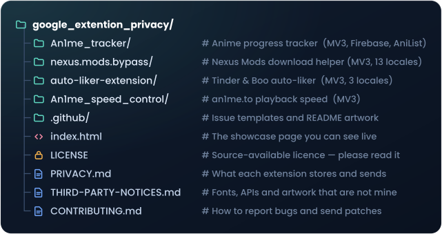

 

##  What is this repository?

This is the **source of four browser extensions**, published openly so that anyone can read exactly
what they do before installing them. Nothing is minified, nothing is obfuscated.

> **Source-available, not open source.** You may read, audit and use official builds.
> You may not redistribute, republish or sell them.

##  The extensions

| Extension | What it does | Version |
|---|---|:--:|
|  | Tracks your anime progress automatically, resumes where you left off, syncs your library to the cloud, marks fillers, connects to AniList, and shows stats, goals and achievements. |  |
|  | Removes the friction from Nexus Mods downloads, queues whole collections, and keeps a local history of finished files. 13 languages. | [manifest.json](nexus.mods.bypass/manifest.json) |
|  | A neon on-page button that likes for you, with a live counter, progress ring and smart pause. 3 languages. |  |
|  | Hold  to boost playback speed, press  to toggle it. Remembers your default speed and volume. |  |

Each folder has its own README with the full feature list, permissions and troubleshooting.

##  Installation

None of these are on the Chrome Web Store yet, so they are installed as **unpacked extensions**.
It takes about 30 seconds.

<b>Chrome / Brave / Opera</b>

 

1. **Download this repository** — click the green `Code` button → `Download ZIP`, then unzip it.
2. Open  in your browser.
3. Turn on **Developer mode** (top-right toggle).
4. Click **Load unpacked**.
5. Select the **folder of the extension you want** — for example `An1me_tracker`, not the whole repo.
6. Pin it to the toolbar with the puzzle-piece icon.

<b>Microsoft Edge</b>

 

1. Download and unzip the repository as above.
2. Open .
3. Turn on **Developer mode** (left sidebar).
4. Click **Load unpacked** and select the extension's folder.

> Pick the **sub-folder**, not the repository root. The root is a showcase page, not an extension.
> If Chrome says *"Manifest file is missing or unreadable"*, you selected one level too high.

**Updating:** download the repo again, replace the folder, then press the reload icon on the
extension card in .

##  Privacy in one paragraph

Nothing is sold, nothing is profiled, and no analytics SDK exists anywhere in this repository.
Three of the four extensions keep **100% of their data on your own machine**. Only **An1me.to
Tracker** sends data off-device, and only if you sign in — your watch library goes to your own
private Firebase document so it can sync between your browsers. Full details, per extension and per
permission, are written up separately.

##  Repository layout

##  Something broken?

Open an issue — there is a guided bug-report form for NexusMods Bypass, and blank issues are
enabled for everything else.

A good report includes: which extension, its version, your browser and version, what you expected,
and what happened instead. Console output ( → Console) helps a lot.

##  Contributing

Pull requests are welcome, with one condition worth knowing up front: contributions are licensed to
the project owner under the terms in the licence, § 4. Read the contributing guide before you
start — it will save you a round trip.

##  Licence

Copyright © 2026 Thomas Thanos. All rights reserved.

| | You may | | You may not |
|:--:|---|:--:|---|
|  | Install and use official builds, free, forever |  | Redistribute the code or builds |
|  | Read, study and audit the source |  | Publish it to any extension store or registry |
|  | Fork on GitHub **for review or to prepare a PR** |  | Sell it, or bundle it with anything that earns money |
|  | Open issues and pull requests |  | Publish modified or derived versions |
| | |  | Use the names, icons or store artwork |

Need an exception? Ask:

Third-party fonts, APIs and artwork keep their own licences, listed separately.

##  Not affiliated

These extensions are not affiliated with, endorsed by, or connected to Nexus Mods, an1me.to, Tinder,
Boo, AniList, MyAnimeList or Google. All product names and trademarks belong to their owners.

 

Made by  — star the repo if any of this saved you time.

