The extensions in this repository include or rely on material that is **not** covered by the
repository's own licence, as referenced in its section 5. Each item below keeps its own licence and
belongs to its own owner. Nothing in this repository claims ownership of any of it.

##  Fonts

### Bundled font files

| File | Font | Used by | Notes |
|---|---|---|---|
| `An1me_tracker/src/fonts/PROXON.ttf` | **PROXON** (v1.003, built with Fontself Maker) | An1me.to Tracker — display headings | Bundled display face. Redistributed as part of this extension only; not offered for reuse. |
| `An1me_tracker/src/fonts/comic_sans.ttf` | **LDFComicSans** (v001.000, LDF) | An1me.to Tracker — accent text | A free display face by LDF. Redistributed as part of this extension only; not offered for reuse. |

> These files are **not** covered by the repository licence and may not be extracted, redistributed
> or reused. If you own either typeface and want the attribution corrected or the file removed,
> get in touch — it will be handled promptly.

### Fonts loaded from Google Fonts

Requested at runtime from `fonts.googleapis.com` / `fonts.gstatic.com`, not bundled:

| Font | Licence |
|---|---|
| **Inter** — Rasmus Andersson |  |
| **Poppins** — Indian Type Foundry, Jonny Pinhorn |  |
| **Bebas Neue** — Ryoichi Tsunekawa / Dharma Type |  |

##  Third-party services and APIs

No code from these services is bundled. The extensions make HTTP requests to their public
endpoints, and each service's own terms and privacy policy govern those requests. Exactly what is
sent, per service, is documented separately.

| Service | Used by | Purpose | Terms |
|---|---|---|---|
| **Firebase Authentication & Cloud Firestore** (Google) | An1me.to Tracker | Optional account and cloud sync |  ·  |
| **AniList** | An1me.to Tracker | Metadata, list import/export |  |
| **Jikan** (unofficial MyAnimeList API) | An1me.to Tracker | Series resolution and metadata |  |
| **AniSkip** | An1me.to Tracker | Intro/outro skip timings |  |
| **AnimeFillerList** | An1me.to Tracker | Filler episode lists |  |
| **Nexus Mods** | NexusMods Bypass | Download links and collection data |  |
| **an1me.to** | An1me.to Tracker, Speed Control | Episode pages and playback | — |
| **Tinder**, **Boo** | Auto Liker | The pages the extension runs on | — |

### Image CDNs

Cover artwork displayed by An1me.to Tracker is fetched from, and remains the property of, its
respective rights holders:

`cdn.myanimelist.net` · `s4.anilist.co` · `image.tmdb.org` · `media.kitsu.app` ·
`img1.ak.crunchyroll.com`

Artwork is displayed by reference only. It is never re-hosted, modified or redistributed.

> This product uses the TMDB API but is not endorsed or certified by TMDB.

##  Bundled code

**None.** No third-party JavaScript library is vendored into this repository. Firebase, AniList and
every other service are reached through plain HTTP calls written by hand — there is no Firebase SDK,
no framework, no bundler and no remotely-loaded code in any of the four extensions.

##  Trademarks

*Nexus Mods*, *Vortex*, *Tinder*, *Boo*, *AniList*, *MyAnimeList*, *Kitsu*, *Crunchyroll*,
*Google*, *Firebase*, *Chrome* and *Microsoft Edge* are trademarks of their respective owners.
They are used here only to describe compatibility and are not claimed by this project.

**None of these extensions are affiliated with, endorsed by, or connected to any of the above.**

##  Something missing or wrong?

If you believe material of yours is included without proper attribution or permission,
let me know and it will be corrected or removed.

