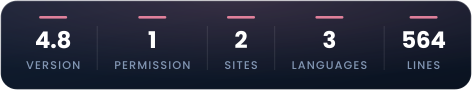
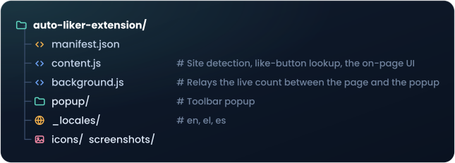

 

##  What it does

Adds a floating pink control to **Tinder** and **Boo**. Press it once and the extension clicks the
like button every 3 seconds, counts as it goes, and stops by itself when something needs your
attention.

That is the whole extension. No account, no server, no configuration screen.

##  Features

- **One-tap on/off** — a glowing button, bottom-right, on both sites.
- **Live counter** of likes in the current session, mirrored in the toolbar popup.
- **Progress ring** that fills every 100 likes.
- **Smart pause** — stops automatically after 4 consecutive failures, which is what happens when
  you hit the daily like limit, an overlay opens, or you navigate away from the card stack.
- **Loading-aware** — waits patiently while a profile is still loading instead of counting it as a
  failure.
- **Match handling** — dismisses the *"It's a Match"* screen and carries on.
- **Live status**: `ON` · `WAIT` · `PAUSED` · `OFF`, so you always know what it is doing.
- **English, Greek and Spanish** UI.

##  Install

1. Download the repository (`Code` → `Download ZIP`) and unzip it.
2. Open  (or ).
3. Enable **Developer mode**.
4. Click **Load unpacked** and select this **`auto-liker-extension` folder**.
5. Open  or  — the button appears
   bottom-right.

##  How to use

| Action | Where |
|---|---|
| Start / stop | Click the neon button on the page, or **Start Auto Like** in the toolbar popup |
| Watch the count | Centre of the ring, or **Total Likes** in the popup |
| Resume after a pause | Click the button again — the counter is not reset |

The counter resets when the page reloads. It is a session counter, not a lifetime score.

##  Permissions explained

| Permission | Why it is needed |
|---|---|
| `activeTab` | Access to the tab you are actively using, and nothing more. |
| `https://tinder.com/*`, `https://boo.world/*` | The only two sites the content script runs on. |

No `storage`, no `tabs`, no history, no all-URLs. It cannot see any other site you visit.

##  Privacy, briefly

**Nothing leaves your browser. Nothing is even saved.** The like count lives in memory in the
background worker and disappears when the browser closes. There is no storage permission, no
network request, no analytics and no account.

##  Before you use it

Worth being straight about this:

- **Automating likes probably breaks Tinder's and Boo's terms of service.** Accounts have been
  restricted for less. You are choosing that risk, not the extension.
- **Liking everyone lowers your match quality.** These platforms weight indiscriminate swiping
  negatively, and the people on the other side notice.
- **Daily like limits still apply.** Smart pause simply notices you have hit yours.

Use it thoughtfully, or not at all.

##  How the code is organised

Around 560 lines in total. You can read the whole thing over a coffee.

##  Troubleshooting

<b>The button does not appear</b>

 

Reload the tab after installing — content scripts do not inject into pages that were already open.
Confirm you are on `tinder.com` or `boo.world` and not a subdomain or a mirror.

<b>It says PAUSED immediately</b>

 

Four consecutive failures. Usually the daily like limit, an open modal, or the fact that you are
not on the swiping screen. Close whatever is on top and press start again.

<b>It stopped finding the like button</b>

 

Both sites change their markup regularly, and the button is located by class and shape. It usually
needs a one-line selector update.

##  Licence

Source-available, all rights reserved.

**Not affiliated with, endorsed by, or connected to Tinder (Match Group) or Boo.**
