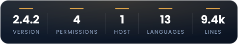
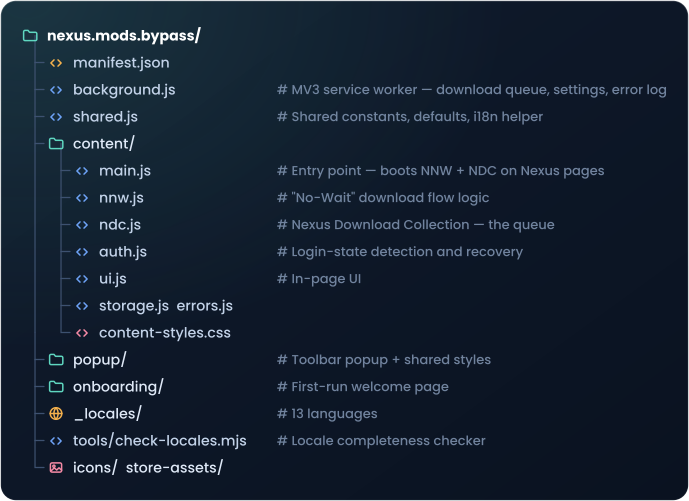

 

##  What it does

Installing a large mod collection by hand means clicking through requirement screens, ad panels and
download pages, one file at a time, for an hour. This extension turns that into: open the collection
page, press start, walk away.

It handles two download modes — **send to Vortex** or **download in the browser** — queues the whole
list, paces itself so Nexus does not rate-limit you, and keeps a local history so an interrupted run
can pick up where it stopped instead of starting over.

##  Features

### The download flow

- **Auto-start downloads** when you land on a file page — no extra click.
- **Skip requirement screens** and go straight to the download step.
- **Archived file buttons** — adds Vortex and browser download buttons back to archived entries that
  Nexus hides.
- **Auto-close Vortex tabs** after the handoff, with a delay you control.
- **Clear error messages** when Nexus fails to return a usable link, instead of a silent dead end.

### Collection downloader

- Detects collection pages and builds a **Ready Queue** of everything in the revision.
- Choose your method per run: **Send to Vortex** or **Browser download**.
- **Paced queue** — a configurable pause between mods, plus a speed estimate for Vortex mode,
  because the browser cannot see a transfer happening inside Vortex.
- **Rate-limit aware** — if Nexus throttles you, the queue pauses and resumes on its own.
- **Local download history** — already-downloaded mods are recognised, so you can pick
  *Skip Downloaded* or *Re-download All* when you retry a collection.
- **Update collection** — compare revisions to see what actually changed.
- Runs in the background service worker, so it survives tab navigation.

### Quality of life

- **Hide ads and Premium panels** — advertising slots, empty ad containers and upgrade banners are
  collapsed while you browse.
- **Guided onboarding page** the first time you install.
- **Built-in bug reporter** that attaches recent extension errors to a pre-filled GitHub issue.
- **Support panel** — entirely optional, never gates a feature.

###  Languages

English, Greek, German, Spanish, French, Italian, Japanese, Korean, Polish, Portuguese (BR),
Russian, Turkish, Simplified Chinese — 322 strings each. There is also an **Always use English**
switch for when your browser language and your Nexus language disagree.

##  Install

1. Download the repository (`Code` → `Download ZIP`) and unzip it.
2. Open  (or ).
3. Enable **Developer mode**.
4. Click **Load unpacked** and select this **`nexus.mods.bypass` folder**.
5. Open a Nexus Mods page — the welcome screen appears on first run.

> **Vortex mode requires Vortex to be running.** The browser hands the link over and cannot verify
> what happens after that, which is why files are recorded as sent rather than as completed.

##  Settings

Reachable from the popup → **Page settings**. Changes save instantly.

| Group | Settings |
|---|---|
| **Download Flow** | Start downloads automatically · Close Vortex tabs (+ delay) · Skip requirement screens · Show error popups |
| **Files & Pacing** | Archived file buttons · Browser download folder · Download request timeout · Your Nexus download speed · Pause between mods |
| **Advanced** | Hide ads and Premium panels · Verbose extension logs |
| **Language** | Always use English |

**Restore Defaults** resets everything and refreshes the Nexus page.

##  Permissions explained

| Permission | Why it is needed |
|---|---|
| `storage` | Your settings and the local download history. |
| `downloads` | Browser download mode — starting files and putting them in your chosen subfolder. |
| `downloads.ui` | Being removed. The "hide the download button" setting is gone as of 2.4.3; the permission is held for one release only, to put the button back for profiles that still have it hidden. Dropped in 2.5.0. |
| `alarms` | Pacing the background queue between mods. |
| `https://www.nexusmods.com/*` | The only site this extension touches. |

That is the complete list. No tabs permission, no all-URLs, no remote code.

##  Privacy, briefly

**Everything stays on your computer.** Settings, history and error logs live in local extension
storage. Nothing is sent anywhere except the requests to Nexus Mods that a download requires — the
same ones your browser would make if you clicked the buttons yourself. No analytics, no ads, no
account.

##  How the code is organised

Contributors: run `node tools/check-locales.mjs` before opening a PR that touches strings.

##  Troubleshooting

<b>Downloads do not start automatically</b>

 

Check **Start downloads automatically** in settings, and confirm you are signed in to Nexus Mods —
the extension detects login state and will not fight an anonymous session.

<b>Vortex never receives the file</b>

 

Vortex must already be running when the handoff happens. If it is slow to start, raise the
**Close-tab delay** so the tab is not closed before Vortex picks up the link.

<b>The collection queue paused itself</b>

 

That is the rate-limit guard. Nexus throttled the account; the queue resumes automatically.
Completed files stay in history, so nothing is re-downloaded when it does.

<b>A collection run keeps re-downloading files I already have</b>

 

When the history dialog appears, choose **Skip Downloaded**. If history was cleared, the extension
has no way to know which files exist on disk.

<b>Reporting a bug</b>

 

Use the popup's **Report a bug** button — it pre-fills the GitHub form with the recent error log.
Turning on **Verbose extension logs** first gives a much more useful report.

##  Licence

Source-available, all rights reserved. The name *NexusMods Bypass*, the icons in `icons/`, and
everything in `store-assets/` are explicitly excluded from all permissions — a review fork may not
carry the branding.

**Not affiliated with, endorsed by, or connected to Nexus Mods.**
